# App 功能布局分析报告

## 路由结构

```
/                        → Home 页面
/:dir                    → Directory Layout（base64 编码的项目路径）
  /:dir/session/:id?     → Session 页面（主工作区）
```

---

## 布局层级

```
Root Layout (layout.tsx)
├── Sidebar Rail (64px)          ← 始终可见
├── Sidebar Panel (可展开)        ← hover 或点击展开
└── Content Area
    ├── Home (home.tsx)          ← 路由 /
    └── Directory Layout         ← 路由 /:dir
        └── Session (session.tsx) ← 路由 /:dir/session/:id?
```

---

## 一、Root Layout (`layout.tsx`)

### 功能清单

| 功能 | 说明 | 平台 |
|------|------|------|
| Sidebar Rail | 左侧窄导航栏（项目图标列表） | 全平台 |
| Sidebar Panel | 展开后显示项目/Workspace/Session 列表 | 全平台 |
| 项目拖拽排序 | 拖拽调整项目顺序 | 全平台 |
| Workspace 拖拽排序 | 拖拽调整 Workspace 顺序 | 全平台 |
| 内联重命名编辑器 | 双击重命名 Workspace/Session | 全平台 |
| 项目 Hover 预览 | 鼠标悬停时 peek 项目内容 | Desktop |
| 移动端 Sidebar 覆盖 | 全屏 overlay 展示 | Mobile |
| 自动选择首个项目 | 无选中项目时自动跳转 | 全平台 |

### Sidebar 子组件

| 组件 | 文件 | 功能 |
|------|------|------|
| SidebarShell | `layout/sidebar-shell.tsx` | Rail + Panel 容器 |
| SortableProject | `layout/sidebar-project.tsx` | 可拖拽的项目条目 |
| LocalWorkspace | `layout/sidebar-workspace.tsx` | Workspace 列表（可折叠） |
| SessionItem | `layout/sidebar-items.tsx` | Session 条目（切换/重命名/删除） |
| InlineEditor | `layout/inline-editor.tsx` | 行内编辑器 |

### Sidebar 截图

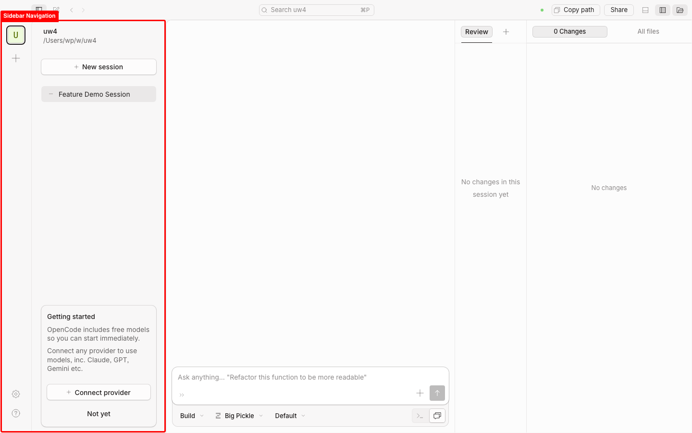

> 红框标注：Sidebar Navigation 区域，包含项目名、路径、New session 按钮、Session 列表、Getting Started 引导卡片

---

## 二、Home 页面 (`home.tsx`)

路由：`/`

| 功能 | 说明 |
|------|------|
| Logo 展示 | OpenCode logo |
| 服务器状态指示器 | 绿/红/灰点（healthy/unhealthy/unknown） |
| 服务器选择按钮 | 切换本地/远程服务器 |
| 最近项目列表 | 最多 5 个，显示路径 + 相对时间 |
| 空状态引导 | 无项目时显示"创建首个项目"CTA |
| 打开项目按钮 | Desktop：原生目录选择器；Web：DialogSelectDirectory |

### Home 截图

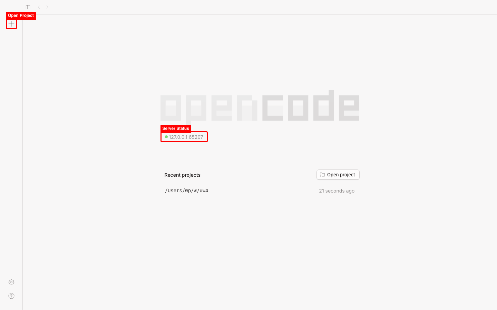

> 红框标注：**Open Project**（左上角 + 按钮）、**Server Status**（绿点 + 地址，healthy 状态）；中间显示 OpenCode Logo（半透明）、Recent projects 列表

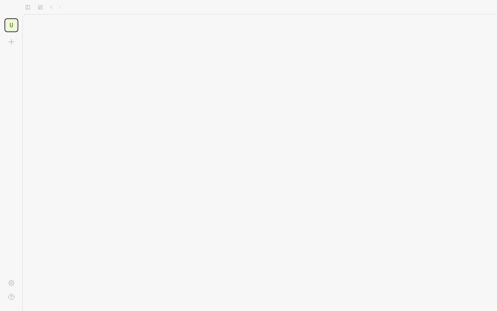

> 有项目时 Home 页会自动跳转到 Session，此截图展示跳转前瞬间的 Sidebar Rail

---

## 三、Session 页面 (`session.tsx`)

路由：`/:dir/session/:id?`

### Desktop 布局（≥768px）

```
┌─────────────────────────────────────────────────────┐
│ Session Header                                       │
├──────────────────────┬──────────────────────────────┤
│                      │  File Tabs (标签栏)           │
│                      ├──────────────────────────────┤
│  Message Timeline    │  Code Viewer / Review Panel   │
│  (对话历史)           │  (代码查看 / 变更审查)         │
│                      │                              │
│                      │                              │
├──────────────────────┴──────────────────────────────┤
│  Composer (输入区域)                                  │
├─────────────────────────────────────────────────────┤
│  Terminal Panel (终端面板)                             │
└─────────────────────────────────────────────────────┘
```

### Session 全貌截图

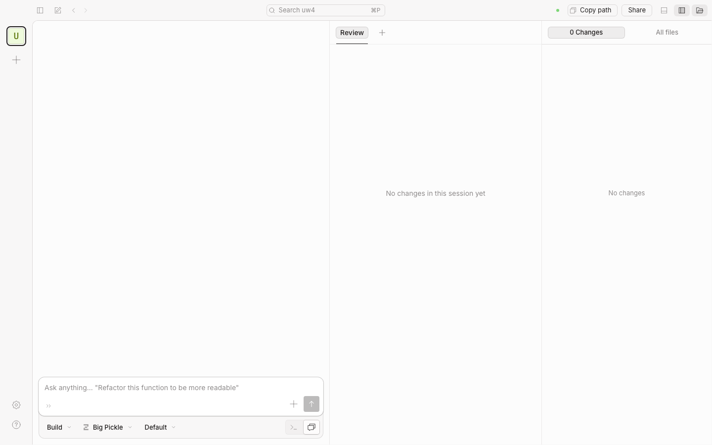

> Session 页面完整视图：左侧 Sidebar Rail、中间 Message Timeline + Composer、右侧 Review Panel + File Tree

### Session 布局分区截图

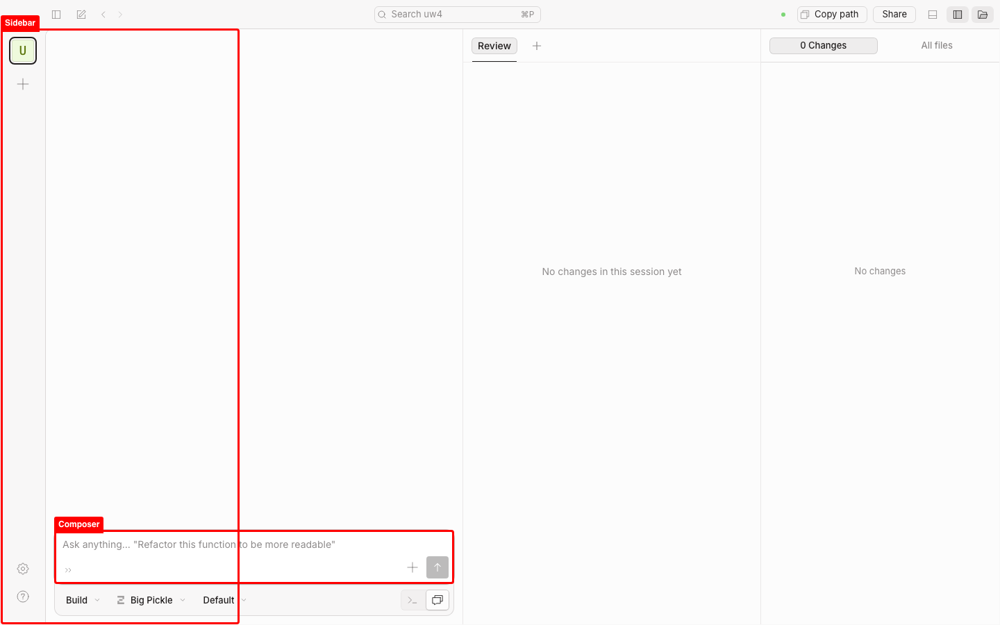

> 红框标注：**Sidebar**（左侧导航）、**Composer**（底部输入区域）

### Mobile 布局（<768px）

```
┌─────────────────────┐
│ Session Header       │
├─────────────────────┤
│ [Session] [Changes]  │  ← Tab 切换器
├─────────────────────┤
│                     │
│  Message Timeline   │  ← 或 Changes 视图
│  (全屏)              │
│                     │
├─────────────────────┤
│  Composer            │
└─────────────────────┘
```

### Mobile 截图

| Mobile Session | Mobile Changes | Mobile Home |
|:-:|:-:|:-:|
| 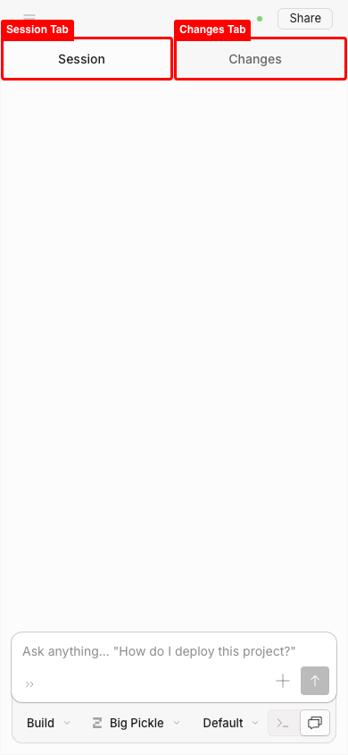 | 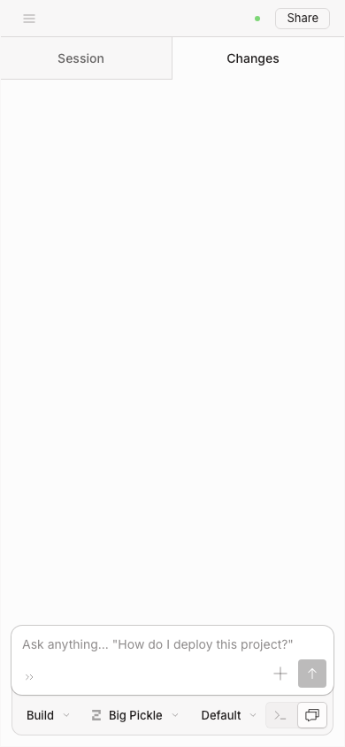 | 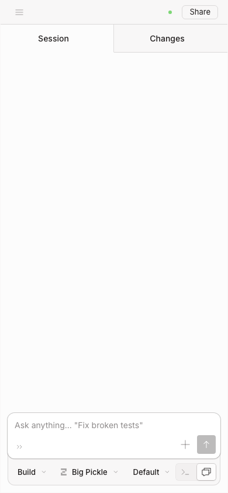 |

> 红框标注：**Session Tab** / **Changes Tab**（顶部切换器）；底部 Composer 始终可见；无 Sidebar

---

### 功能模块详细清单

#### 3.1 Session Header (`session-header.tsx`)

| 功能 | 说明 |
|------|------|
| Session 标题 | 显示当前会话名 |
| Model 选择器 | 切换 AI 模型（带 Provider 图标） |
| 复制/分享 Session | 复制会话链接 |
| 在编辑器中打开 | VS Code / Cursor / Zed 等 |
| Fork Session | 创建会话分支 |
| 更多选项下拉 | 其他操作菜单 |
| Session 导航 | 上一个/下一个会话切换 |

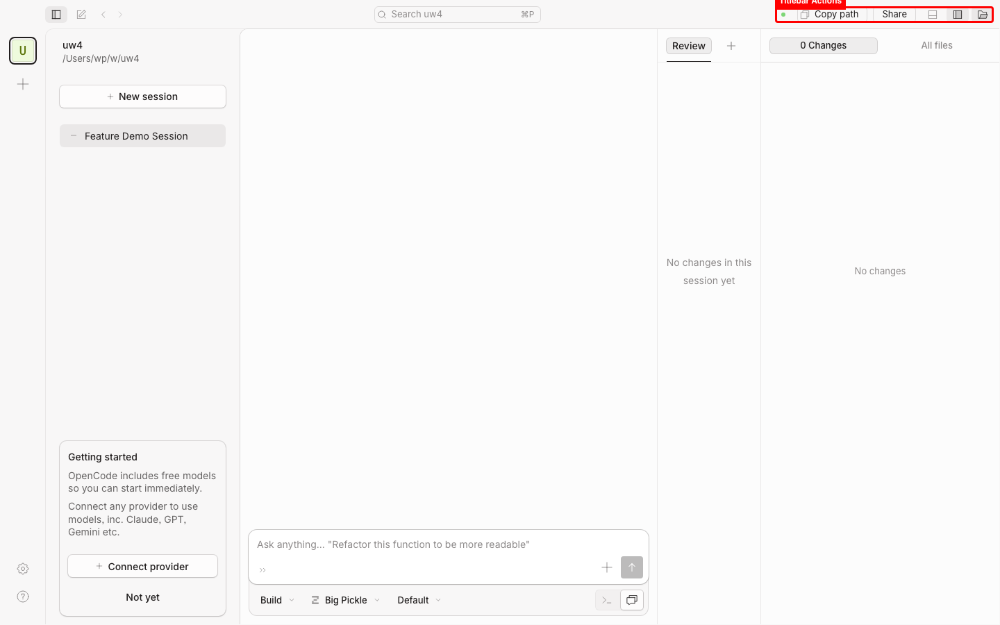

> 红框标注：**Titlebar Actions**（右上角：状态指示灯、Copy path、Share、布局切换按钮）

#### 3.2 Message Timeline (`message-timeline.tsx`)

| 功能 | 说明 |
|------|------|
| 对话历史滚动 | 用户/AI 消息交替展示 |
| 消息编辑/重新生成 | 修改已发消息 |
| 历史窗口化加载 | 初始 10 条，滚动加载更多（每次 8 条） |
| "加载更早消息"按钮 | 手动加载历史 |
| 消息导航 | 跳转到指定消息 |
| 消息行内评论 | synthetic parts 检测时显示 |

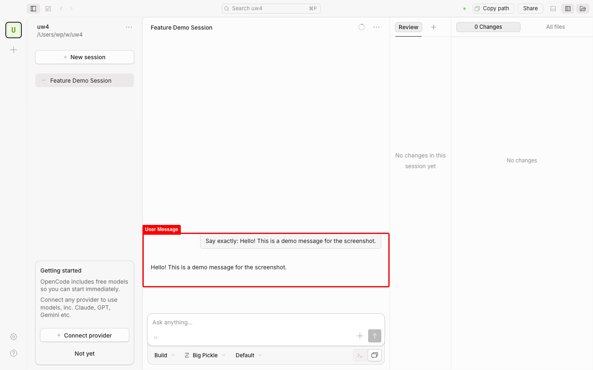

> 通过 SDK seeding 发送消息后截图，红框标注用户消息气泡

#### 3.3 Composer 输入区域 (`session-composer-region.tsx`)

| 功能         | 说明                   |
| ---------- | -------------------- |
| 富文本输入      | contenteditable 自动展开 |
| 占位提示       | 24 种 AI 任务示例随机展示     |
| 图片上传       | 粘贴或按钮上传              |
| 文件附件       | 选择代码文件附加             |
| Agent 选择器  | 选择对话的 AI Agent       |
| Context 面板 | 展示已选代码片段、文件、评论       |
| Model 选择器  | 带价格信息的模型切换           |
| 提交按钮       | 发送消息                 |
| 语音输入       | 语音转文字（如可用）           |
| Slash 命令   | `/` 触发 AI 命令弹窗       |
| @ 提及       | `@` 触发 Agent/文件引用    |
| 历史回溯       | 上下箭头浏览发送历史           |
| 快捷键聚焦      | 任意按键自动聚焦输入框          |

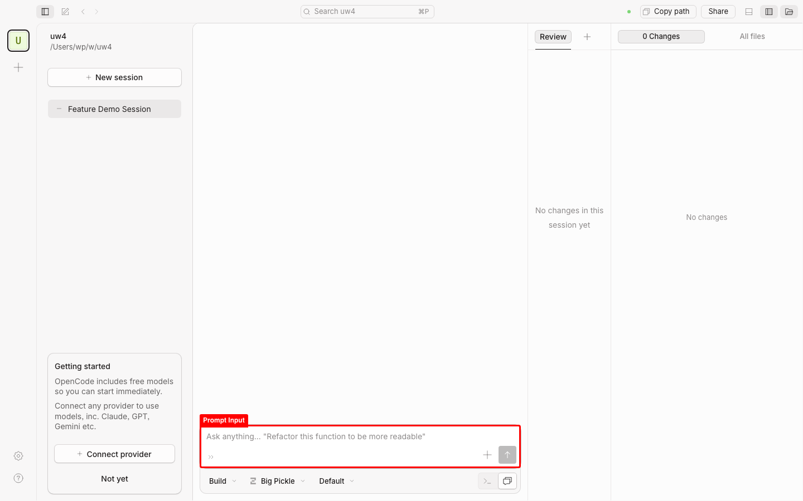

> 红框标注：**Prompt Input**（输入框 + `»` context 按钮 + `+` 附件按钮 + 发送按钮）

#### 3.3.1 Composer Toolbar

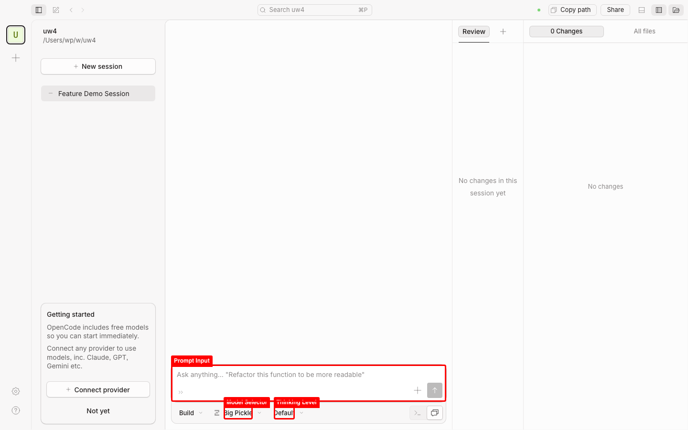

> 红框标注：**Prompt Input**（输入框）、**Model Selector**（Big Pickle）、**Thinking Level**（Default）；左侧还有 Agent Selector（Build）

#### 3.4 Slash 命令弹窗

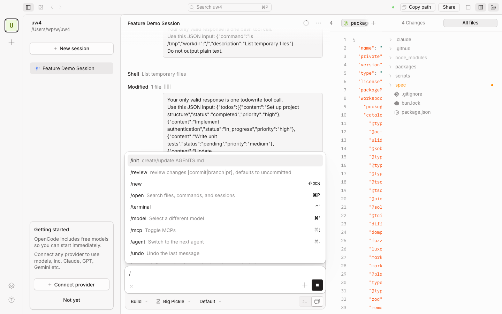

> 输入 `/` 后弹出的命令列表：/init、/review、/new、/open、/terminal、/model、/mcp、/agent、/share 等

#### 3.4.1 @ Mention 弹窗

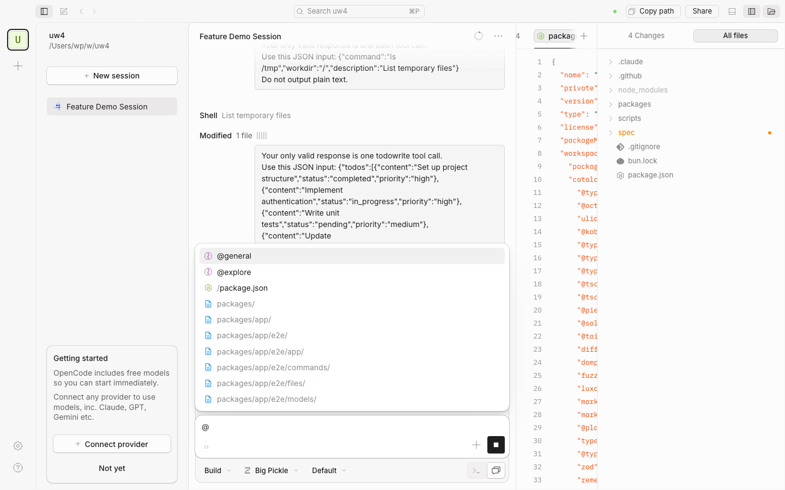

> 输入 `@` 后弹出 Agent 和文件引用列表：@general、@explore、以及项目目录文件

#### 3.5 Composer Docks（输入框上方浮层）

| 组件 | 文件 | 功能 |
|------|------|------|
| Permission Dock | `composer/session-permission-dock.tsx` | 权限请求审批按钮 |
| Question Dock | `composer/session-question-dock.tsx` | AI 后续问题回复 |
| Todo Dock | `composer/session-todo-dock.tsx` | Agent 待办事项确认 |

##### Question Dock

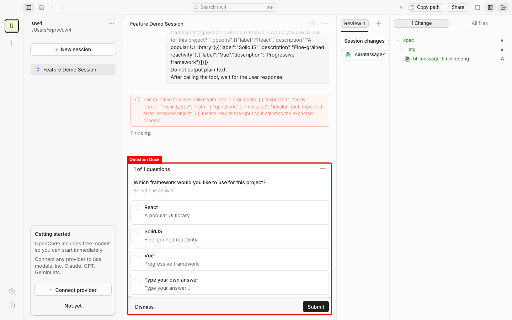

> 通过 SDK seeding 触发 question tool call，红框标注 Question Dock（含选项列表和回复按钮）

##### Permission Dock

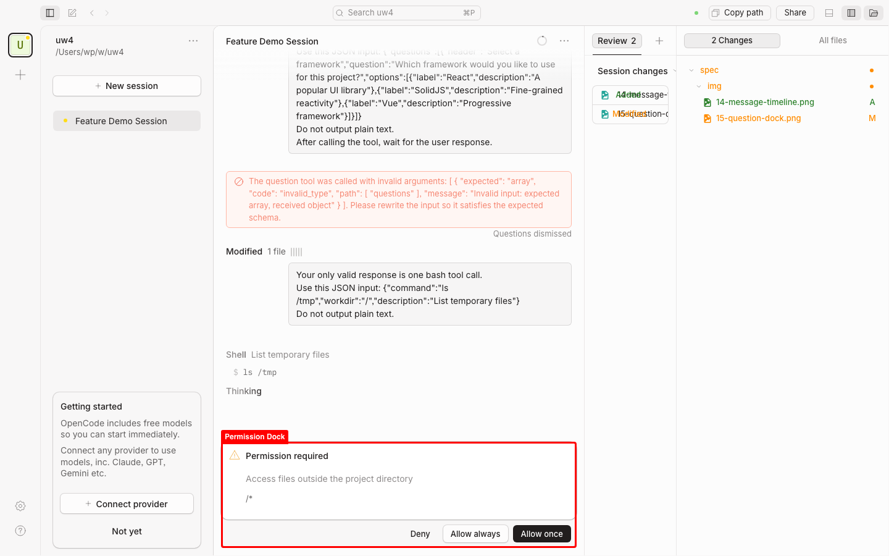

> 通过 SDK seeding 触发 bash tool call，红框标注 Permission Dock（含命令描述和 Reject/Allow 按钮）

##### Todo Dock

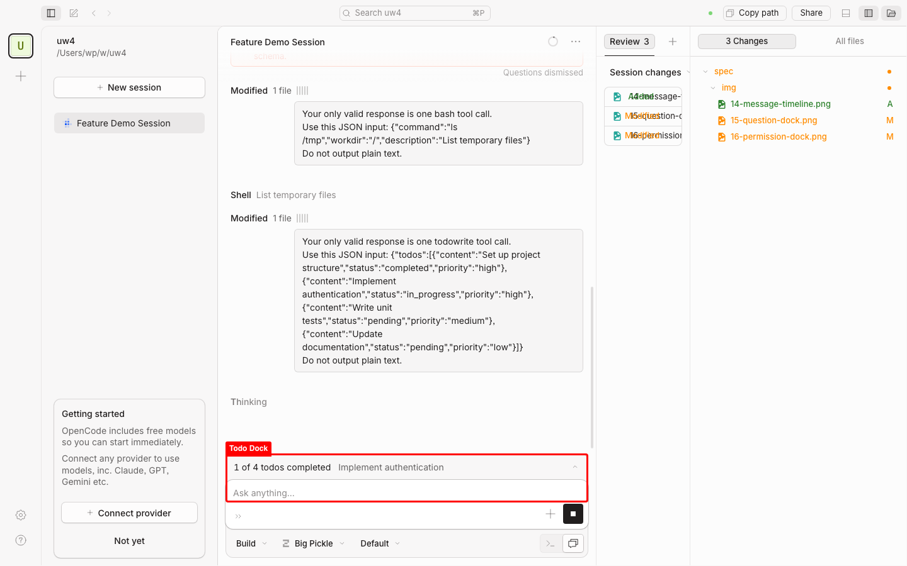

> 通过 SDK seeding 触发 todowrite tool call，红框标注 Todo Dock（含待办列表：completed/in_progress/pending 状态）

#### 3.6 Side Panel — Review/Changes

| 功能 | 说明 | 平台 |
|------|------|------|
| Git Diff 展示 | 统一或分栏 diff 视图 | Desktop |
| Session 变更 vs 单轮变更 | 切换全会话/最新一轮的文件变更 | Desktop |
| 文件级操作 | 打开、回退文件 | Desktop |
| 行级评论 | 在任意行添加/编辑/删除评论 | Desktop |
| 无 VCS 状态 | 显示"创建 Git 仓库"按钮 | Desktop |
| Mobile Changes 视图 | Tab 切换后全屏 diff 展示 | Mobile |

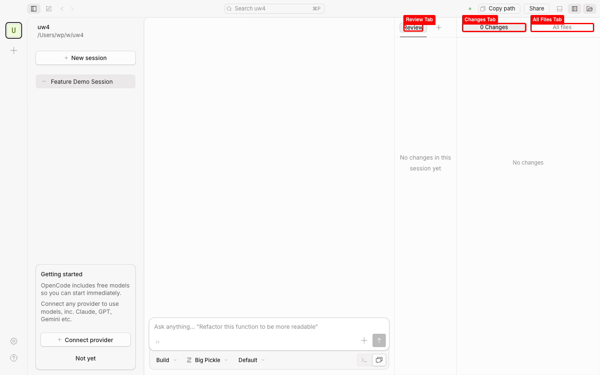

> 红框标注：**Review Tab**（代码审查）、**Changes Tab**（0 Changes 变更计数）、**All Files Tab**（全部文件列表）

#### 3.7 Side Panel — File Tabs (`file-tabs.tsx`)

| 功能 | 说明 | 平台 |
|------|------|------|
| 多文件标签页 | 顶部标签栏切换文件 | Desktop |
| 文件状态指示 | 修改/新增/删除标记 | Desktop |
| 标签拖拽排序 | 拖拽调整标签顺序 | Desktop |
| 关闭/右键菜单 | 关闭标签、上下文菜单 | Desktop |
| 语法高亮代码查看 | 带行号、折叠、搜索 | Desktop |
| 行评论标注 | 代码行内注释 | Desktop |
| 滚动位置记忆 | 切换标签保留滚动位置 | Desktop |

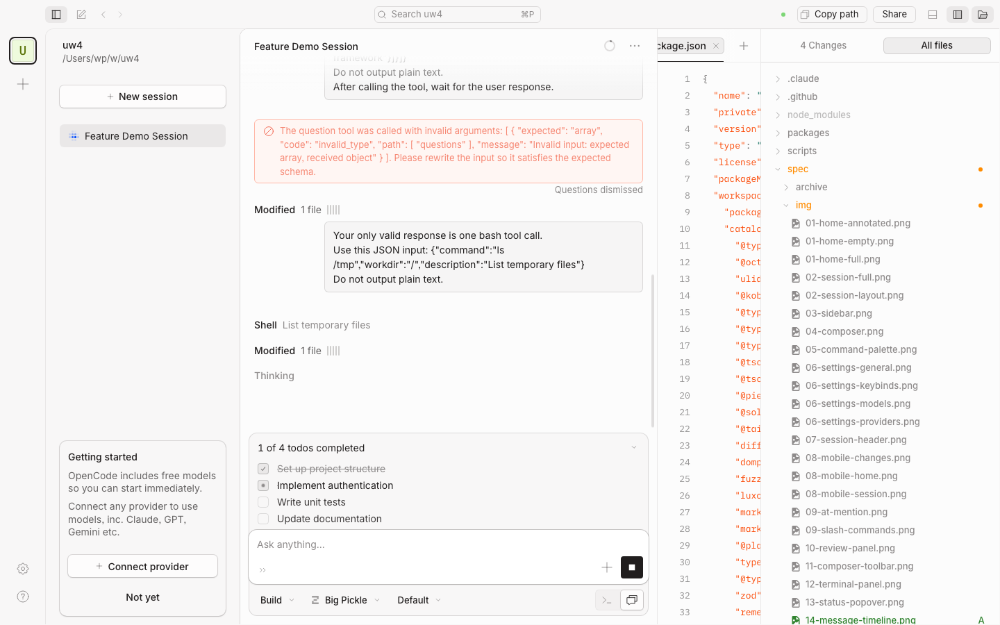

> 通过 Mod+P 文件搜索打开 package.json 后的截图，展示文件标签页和代码查看器

#### 3.8 File Tree (`file-tree.tsx`)

| 功能 | 说明 | 平台 |
|------|------|------|
| 全部文件 vs 仅变更 | Tab 切换文件列表模式 | Desktop |
| 文件图标和路径 | 带状态标记的文件列表 | Desktop |
| 点击打开文件 | 在编辑器标签中打开 | Desktop |
| 搜索过滤 | 文件名搜索 | Desktop |

> 注：File Tree 在 Review Panel 截图中可见（右侧 "All files" Tab 区域，当前显示 "No changes"）

#### 3.9 Terminal Panel (`terminal-panel.tsx`)

| 功能 | 说明 | 平台 |
|------|------|------|
| 多终端标签页 | 多个终端实例 | Desktop |
| 标签拖拽排序 | 拖拽调整终端顺序 | Desktop |
| 终端模拟器 | xterm 风格终端 | Desktop |
| 标签重命名 | 右键重命名终端 | Desktop |
| 自动创建/关闭 | 打开面板自动创建首个终端 | Desktop |
| 面板高度可调 | 拖拽调整终端面板高度 | Desktop |

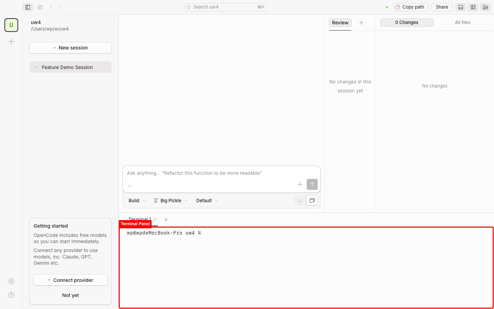

> 红框标注：**Terminal Panel**（底部终端面板，含 Terminal 1 标签页、关闭/新增按钮、xterm 终端模拟器）

---

## 四、全局共享组件

### 4.1 Command Palette

| 功能 | 说明 |
|------|------|
| 快捷键触发 | Cmd+K / Ctrl+K |
| 搜索命令 | 模糊搜索所有命令 |
| 分类展示 | 文件、会话、设置等分类 |

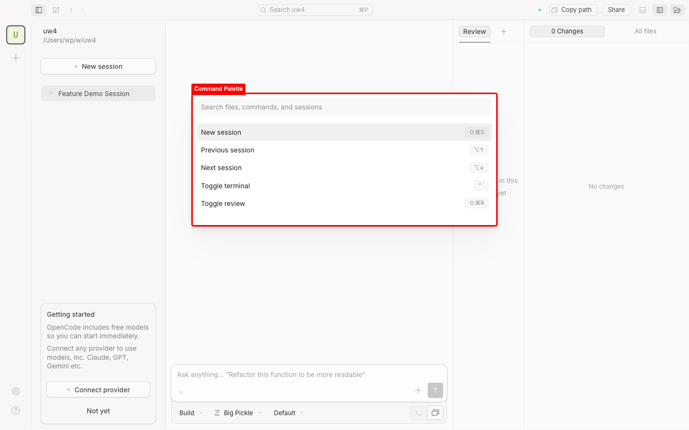

> 红框标注：**Command Palette** 对话框（搜索框 + 命令列表：New session、Previous/Next session、Toggle terminal、Toggle review）

### 4.2 Settings Dialog (`dialog-settings.tsx`)

| Tab | 功能 |
|-----|------|
| General | 主题、配色方案、语言、声音、通知、桌面选项 |
| Keyboard Shortcuts | 快捷键搜索、自定义绑定 |
| Providers | AI Provider 配置（API Key、OAuth） |
| Models | 模型列表、定价、默认模型、模型过滤 |

#### Settings - General

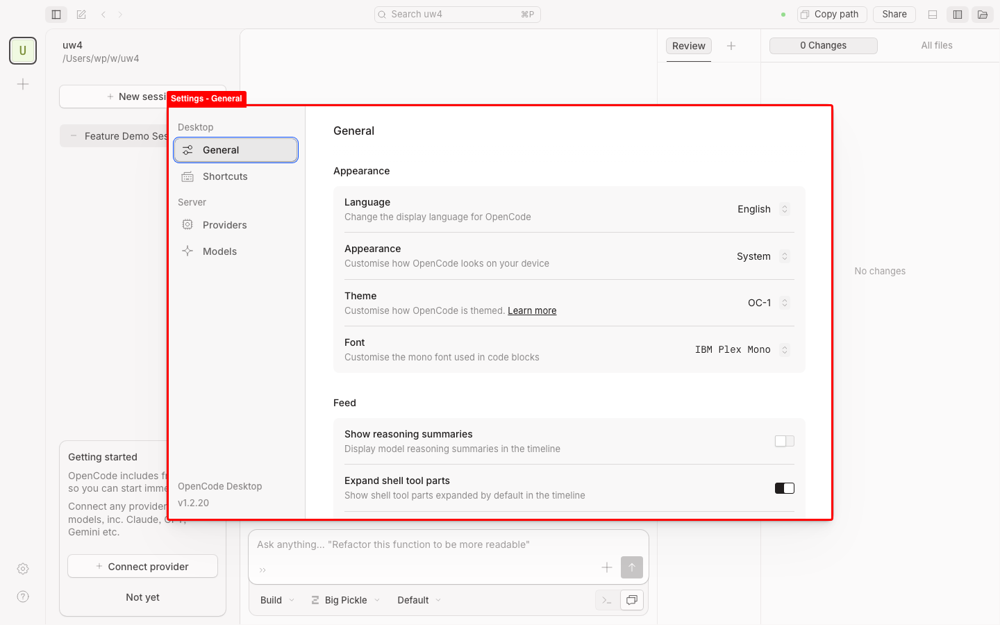

> Appearance 区域：Language、Appearance（System/Light/Dark）、Theme、Font；Feed 区域：Show reasoning summaries、Expand shell tool parts

#### Settings - Keyboard Shortcuts

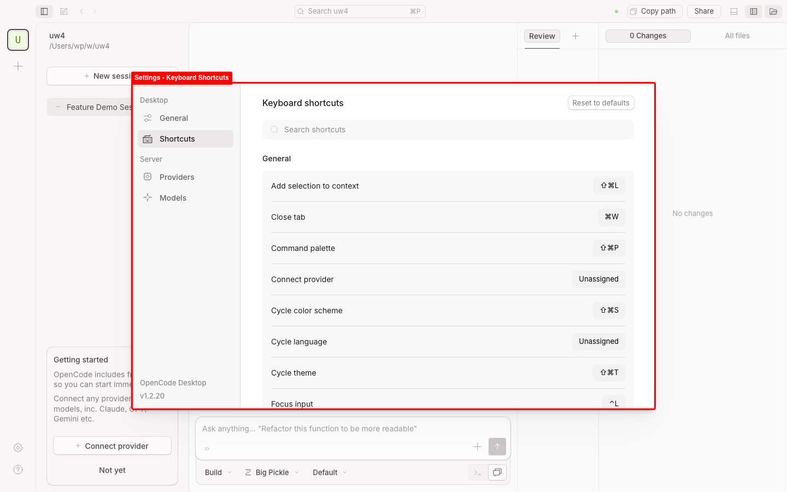

> 快捷键列表：Add selection to context、Close tab、Command palette、Connect provider、Cycle color scheme、Cycle language、Cycle theme、Focus input 等

#### Settings - Providers

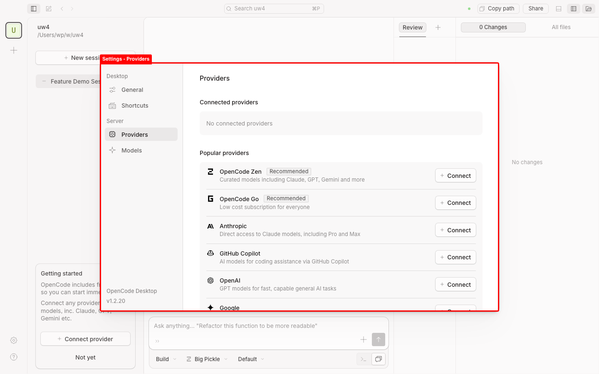

> Connected providers（已连接）+ Popular providers 列表：OpenCode Zen、OpenCode Go、Anthropic、GitHub Copilot、OpenAI、Google 等，每个带 Connect 按钮

#### Settings - Models

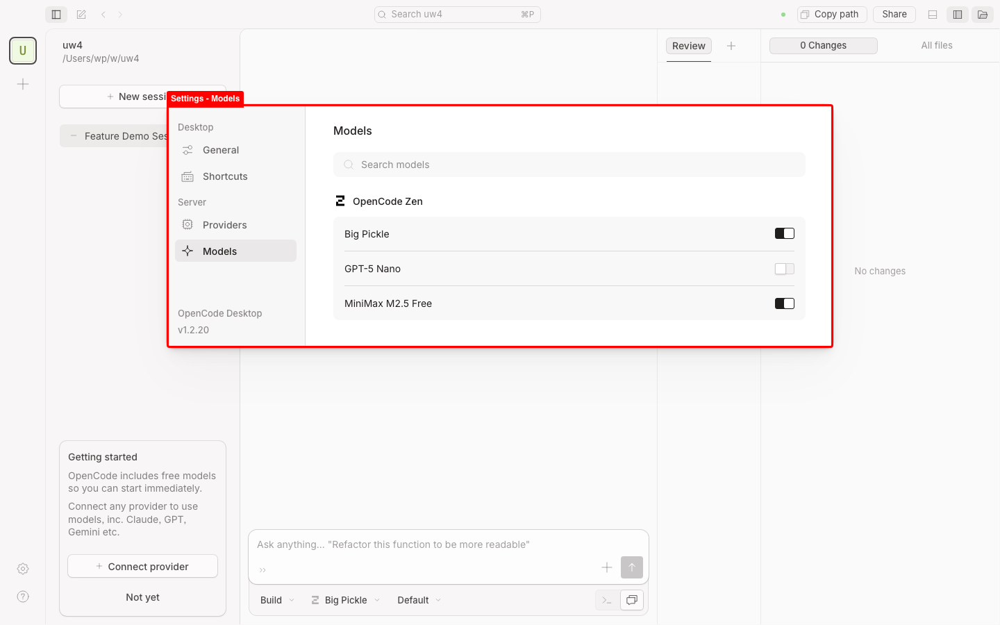

> 模型列表（按 Provider 分组）：Big Pickle、GPT-5 Nano、MiniMax M2.5 Free，每个带启用/禁用开关

### 4.3 其他 Dialog

| Dialog | 功能 |
|--------|------|
| DialogSelectDirectory | 文件浏览器选择项目目录 |
| DialogSelectServer | 切换本地/远程服务器 |
| DialogSelectModel | 模型选择器（带价格） |
| DialogSelectProvider | Provider 认证流程 |
| DialogSelectFile | 文件选择器（附件） |
| DialogSelectMCP | MCP 服务器选择 |
| DialogEditProject | 项目重命名/配置 |
| DialogFork | Session 分支选项 |
| DialogReleaseNotes | 应用更新信息 |
| DialogConnectProvider | OAuth/API Key 流程 |
| DialogCustomProvider | 自定义 AI Provider |
| DialogManageModels | 模型库管理 |

### 4.4 Status Popover (`status-popover.tsx`)

| 功能 | 说明 |
|------|------|
| 服务器连接状态 | 连接/断开指示 |
| 当前模型信息 | 使用中的模型 |
| 权限状态 | 当前权限级别 |
| Context 使用量 | Token 用量指标 |

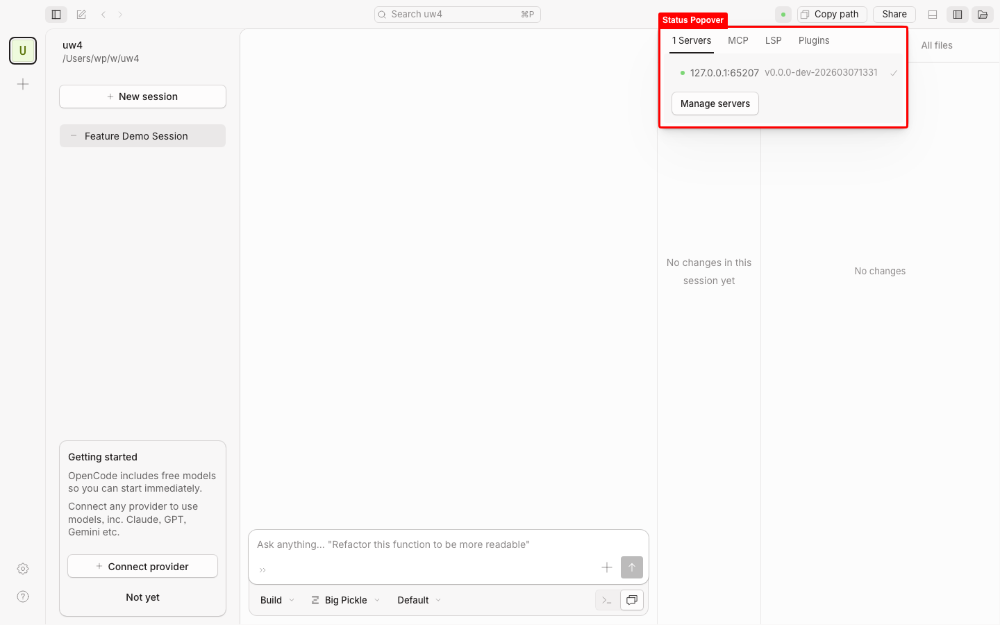

> 红框标注：**Status Popover**（含 Servers / MCP / LSP / Plugins 四个 Tab，显示服务器连接状态、版本号、Manage servers 按钮）

### 4.5 Toast 通知

| 功能 | 说明 |
|------|------|
| 位置 | 右下角 |
| 类型 | info / success / error / warning |
| 自动消失 | 可配置持久显示 |
| 操作按钮 | 可点击的行动按钮 |

---

## 五、响应式/状态驱动的布局变化

| 条件 | 布局变化 |
|------|----------|
| Desktop (≥768px) | 完整多面板布局：侧面板 + 文件树 + 终端 |
| Mobile (<768px) | 堆叠布局：Tab 切换 Session/Changes |
| Sidebar 折叠 | 仅显示 Rail（64px），hover 临时展开 |
| Sidebar 展开 | 显示完整项目/Workspace 列表 |
| File Tree 关闭 | 隐藏，不渲染 |
| File Tree 全部文件 | 显示项目所有文件 |
| File Tree 仅变更 | 显示 git 变更文件 |
| Terminal 打开 | 底部可调节高度面板 |
| Terminal 关闭 | 完全隐藏 |
| 无 Git 仓库 | Review 面板显示"创建 Git 仓库"按钮 |
| 无 Session ID | 显示新建 Session 视图（Worktree 选择器） |
| 等待 AI 回复 | Composer 输入禁用/灰显 |
| 权限请求 | Composer 上方浮出 Permission Dock |

---

## 六、关键文件索引

| 文件 | 说明 |
|------|------|
| `src/app.tsx` | 路由配置 |
| `src/entry.tsx` | 应用入口 |
| `src/pages/home.tsx` | Home 页面 |
| `src/pages/layout.tsx` | Root Layout + Sidebar |
| `src/pages/directory-layout.tsx` | Directory 上下文 |
| `src/pages/session.tsx` | Session 主页面（最大最复杂） |
| `src/pages/layout/sidebar-*.tsx` | Sidebar 子组件 |
| `src/pages/session/session-header.tsx` | Header |
| `src/pages/session/message-timeline.tsx` | 对话历史 |
| `src/pages/session/session-side-panel.tsx` | 右侧面板 |
| `src/pages/session/file-tabs.tsx` | 文件标签页 |
| `src/pages/session/terminal-panel.tsx` | 终端面板 |
| `src/pages/session/composer/*.tsx` | Composer 子组件 |
| `src/components/prompt-input.tsx` | 输入框（最大组件） |
| `src/components/dialog-settings.tsx` | 设置对话框 |
| `src/components/dialog-*.tsx` | 各种对话框 |
| `src/components/file-tree.tsx` | 文件树 |
| `src/components/terminal.tsx` | 终端模拟器 |
| `src/components/status-popover.tsx` | 状态弹窗 |
| `src/components/titlebar.tsx` | Desktop 标题栏 |

---

## 七、截图索引

| 文件 | 内容 | 标注 |
|------|------|------|
| `img/01-home-empty.png` | Home 页（含 Logo） | Open Project, Server Status |
| `img/01-home-full.png` | Home 页（有项目） | — |
| `img/01-home-annotated.png` | Home 页标注 | Open Project |
| `img/02-session-full.png` | Session 页全貌 | — |
| `img/02-session-layout.png` | Session 布局分区 | Sidebar, Composer |
| `img/03-sidebar.png` | Sidebar 展开 | Sidebar Navigation |
| `img/04-composer.png` | Composer 输入区 | Prompt Input |
| `img/05-command-palette.png` | 命令面板 | Command Palette |
| `img/06-settings-general.png` | 设置 - General | Settings Dialog |
| `img/06-settings-keybinds.png` | 设置 - Shortcuts | Keyboard Shortcuts |
| `img/06-settings-providers.png` | 设置 - Providers | Providers 列表 |
| `img/06-settings-models.png` | 设置 - Models | Models 开关 |
| `img/07-session-header.png` | Titlebar 操作区 | Titlebar Actions |
| `img/08-mobile-session.png` | Mobile Session | Session Tab, Changes Tab |
| `img/08-mobile-changes.png` | Mobile Changes | — |
| `img/08-mobile-home.png` | Mobile Home | — |
| `img/09-slash-commands.png` | Slash 命令弹窗 | Slash Commands |
| `img/09-at-mention.png` | @ Mention 弹窗 | @general, @explore, 文件列表 |
| `img/10-review-panel.png` | Review Panel | Review Tab, Changes Tab, All Files |
| `img/11-composer-toolbar.png` | Composer Toolbar | Prompt Input, Model, Thinking Level |
| `img/12-terminal-panel.png` | Terminal Panel | Terminal Panel |
| `img/13-status-popover.png` | Status Popover | Servers/MCP/LSP/Plugins |
| `img/14-message-timeline.png` | Message Timeline | User Message |
| `img/15-question-dock.png` | Question Dock | Question Dock |
| `img/16-permission-dock.png` | Permission Dock | Permission Dock |
| `img/17-todo-dock.png` | Todo Dock | Todo Dock |
| `img/18-file-tabs.png` | File Tabs | 文件标签页 + 代码查看器 |

> 截图脚本：`packages/app/script/screenshot-features.ts`，可随时重新生成
>
> 通过 SDK seeding（参考 `e2e/actions.ts` 中的 `seedSessionQuestion`、`seedSessionPermission`、`seedSessionTodos` 模式）实现了运行时依赖状态的模块截图
>
> 注：**Toast 通知** 和 **File Tree 内容**（变更文件列表）仍需特定触发条件，暂未截图
