# UltraWork (无影) 功能布局分析报告

> 基于 Figma 设计稿（`ultrademo/`）和设计截图（`ultrademopng/`）分析。
> 产品名：**无影 UltraWork** —— 聊天办公，简单轻松。本地运行、智能规划、安全可控的 AI 工作搭子。

---

## 视图结构

```
Main (无路由，单页应用，状态驱动视图切换)
├── Home View          ← 默认视图（欢迎 + 任务创建）
├── ChatDetail View    ← 任务执行详情（对话 + 产物预览）
└── Settings View      ← 全局设置（通用 / 隐私 / 能力配置）
```

---

## 布局层级

```
App Root
├── Left Sidebar (可折叠, ~210px)
│   ├── Logo + 折叠按钮
│   ├── 快捷操作区（新建任务 / 搜索 / 定时任务 / 自定义）
│   ├── 定时任务列表
│   ├── 最近任务列表
│   └── 底部用户头像 + Settings Popover
└── Content Area (flex-1)
    ├── Top Bar (导航前进后退 + 标题 + 操作)
    └── View Content
        ├── Home → Ability Cards + Composer
        ├── ChatDetail → Chat Area + Right Sidebar + Artifact Preview
        └── Settings → Settings Nav + Settings Content
```

---

## 一、Left Sidebar (`Sidebar.tsx`)

### 功能清单

| 功能 | 说明 |
|------|------|
| Logo 展示 | 无影 UltraWork 品牌标识（紫蓝渐变 + Sparkles 图标） |
| Sidebar 折叠/展开 | 点击 Logo 或折叠按钮切换，折叠后仅显示图标 |
| 新建任务 | `+` 按钮，回到 Home 视图 |
| 搜索 | 搜索历史任务 |
| 定时任务入口 | 进入定时任务管理 |
| 自定义入口 | 进入 Skills / MCP / Plugins 定制页 |
| 定时任务列表 | 仅显示已生效的定时任务（绿色圆点指示），含名称 + 频率 |
| 最近任务列表 | 最近 15 条，running 任务置顶（橙色旋转图标），已完成（绿色勾） |
| 任务右键操作 | 三个点菜单：收藏 / 重命名 / 删除 |
| 内联重命名 | 点击"重命名"后行内编辑，Enter 确认，Esc 取消 |
| 删除确认 | AlertDialog 确认删除 |
| 用户头像区域 | 底部显示头像 + 昵称 + 齿轮图标 |
| Settings Popover | 点击头像区域弹出快捷设置菜单 |

### Sidebar 截图

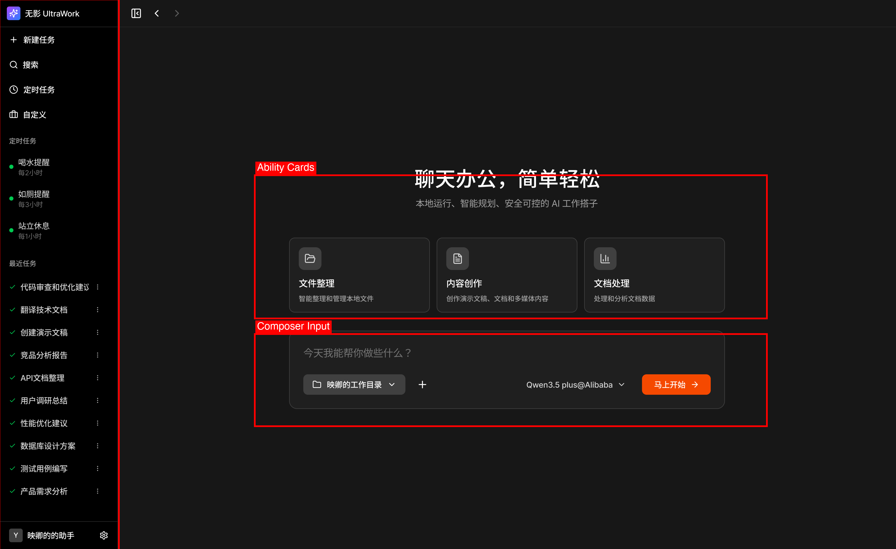

> 红框标注：**Left Sidebar**（左侧导航栏，含新建任务、搜索、定时任务、自定义、任务列表、用户头像）、**Ability Cards**（能力卡片区）、**Composer Input**（输入框区域）

---

## 二、Home 视图 (`MainContent.tsx`)

### 功能清单

| 功能 | 说明 |
|------|------|
| 欢迎标题 | "聊天办公，简单轻松" + 副标题 |
| 能力卡片 | 三张卡片：文件整理 / 内容创作 / 文档处理 |
| Prompt 推荐列表 | 点击能力卡片展开，每类 3 条推荐 prompt，自动滚动轮播 |
| 点击 Prompt 填充 | 点击推荐 prompt 自动填入输入框 |
| 输入框 | "今天我能帮你做些什么？" 占位文字 |
| 工作目录选择器 | 下拉切换工作目录，显示最近使用的目录 |
| `+` 按钮菜单 | 上传附件 / MCP 服务 / 技能 / 插件（各带级联子菜单） |
| 模型选择器 | 下拉选择模型（Qwen3.5 plus / GPT-4 / Claude 3 / Gemini Pro） |
| 深度思考开关 | 模型选择器底部，开启/关闭深度思考模式 |
| 马上开始按钮 | 橙色 CTA 按钮，可选思考方式（标准 / 快速 / 深度 / 创意） |

### Home 截图（浅色主题）

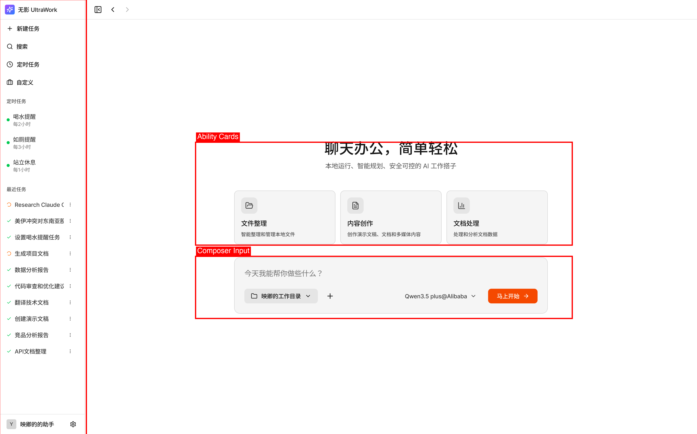

> 红框标注：**Left Sidebar**、**Ability Cards**（文件整理 / 内容创作 / 文档处理三张卡片）、**Composer Input**（输入框 + 工作目录 + 模型选择 + 马上开始）

### 推荐 Prompt 展开截图

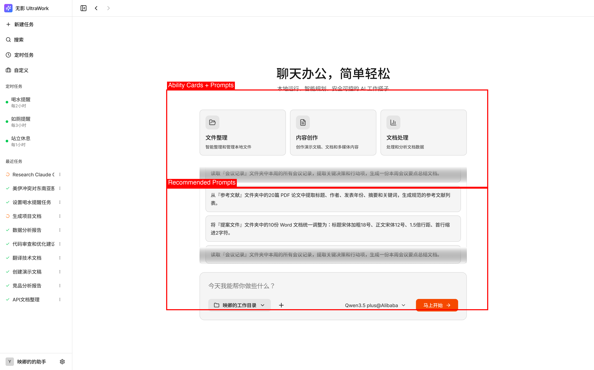

> 红框标注：**Ability Cards + Prompts**（选中能力卡片后展开）、**Recommended Prompts**（推荐 prompt 列表，带渐变遮罩自动滚动）

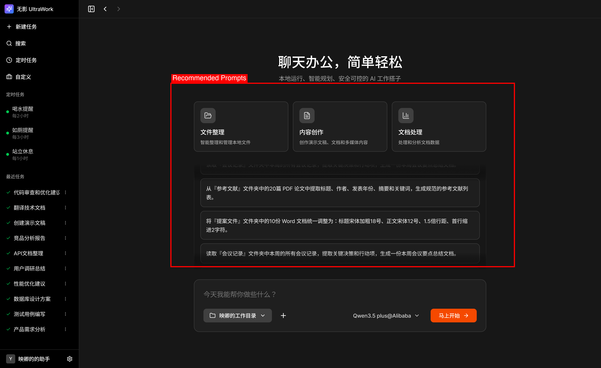

> 深色主题下的推荐 Prompt 列表

### 模型选择器截图

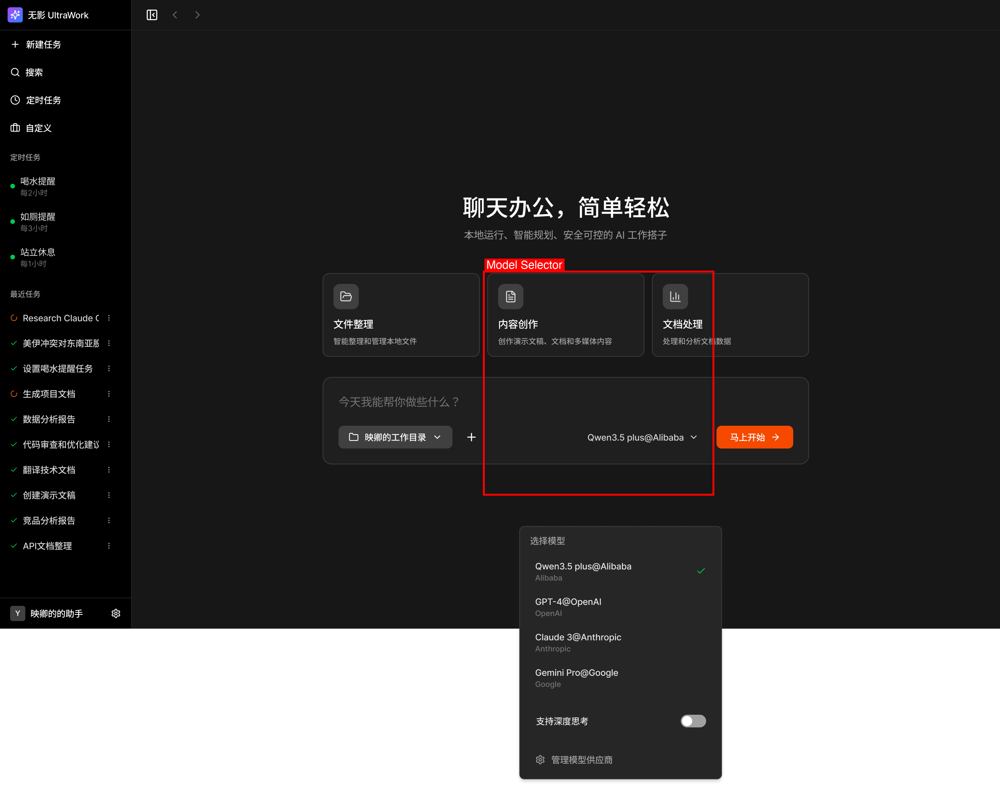

> 红框标注：**Model Selector**（模型列表 + 深度思考开关 + 管理模型供应商入口）

### `+` 按钮菜单截图

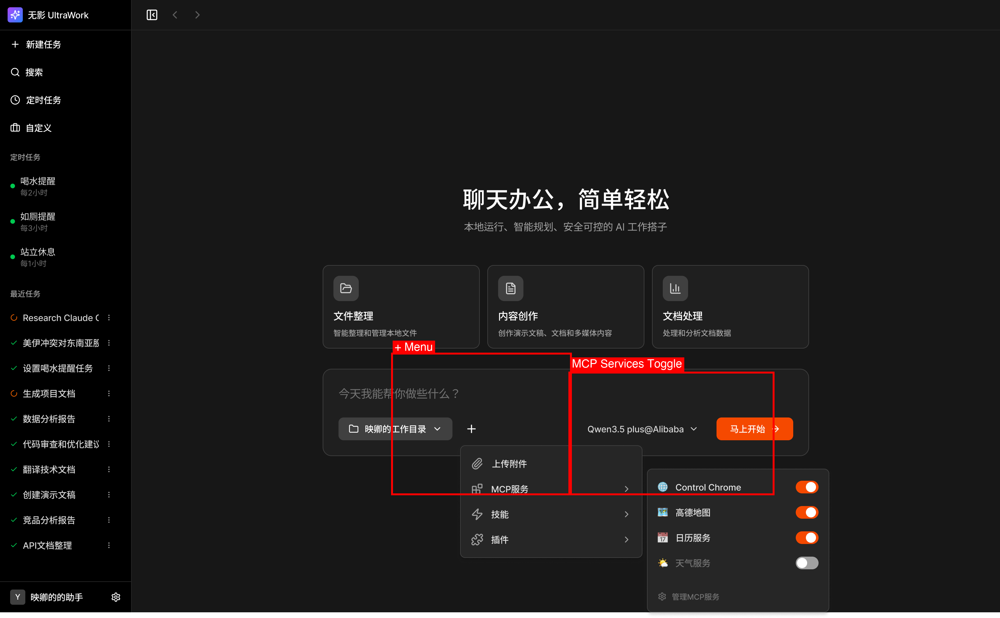

> 红框标注：**+ Menu**（上传附件 / MCP服务 / 技能 / 插件）、**MCP Services Toggle**（MCP 服务开关列表：Control Chrome / 高德地图 / 日历服务 / 天气服务）

### 任务操作截图

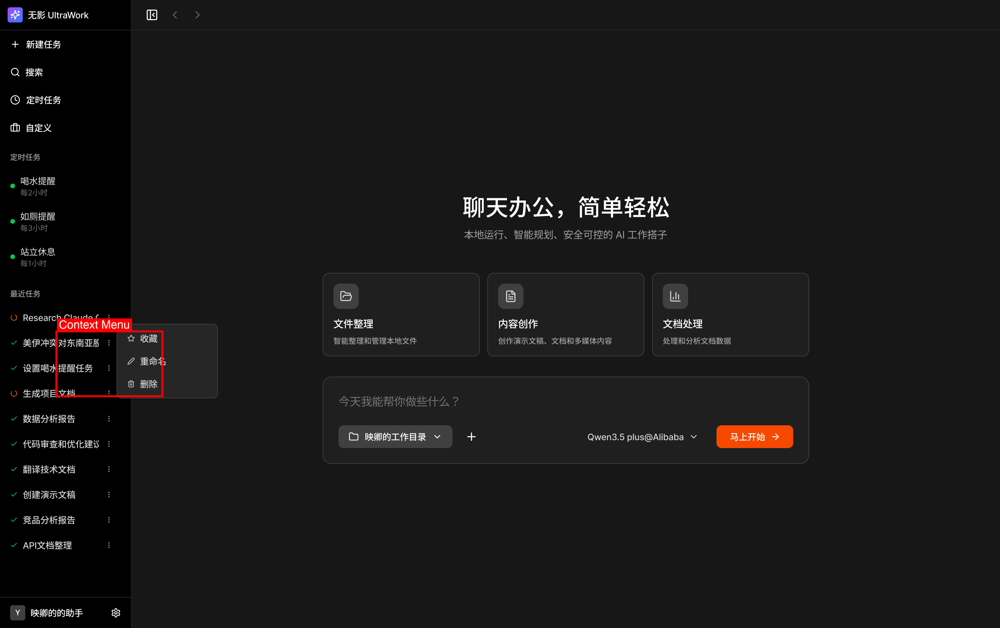

> 红框标注：**Context Menu**（收藏 / 重命名 / 删除）

---

## 三、ChatDetail 任务执行视图 (`ChatDetail.tsx`)

### 整体布局

```
┌─────────────────────────────────────────────────────────────┐
│  Top Bar（Sidebar 折叠按钮 + 前进后退 + 任务标题 + 关闭）     │
├──────────────────────┬──────────────────┬───────────────────┤
│                      │                  │  Right Sidebar    │
│  Chat Area           │  Artifact        │  (可折叠)          │
│  (对话消息流)         │  Preview         │  ├ 计划执行进度     │
│                      │  (产物预览)       │  ├ 工作区           │
│                      │  (按需显示)       │  ├ 产物列表         │
│                      │                  │  ├ MCP服务          │
│                      │                  │  └ 技能             │
├──────────────────────┴──────────────────┤                   │
│  Composer（"继续对话..." 输入框）         │                   │
└─────────────────────────────────────────┴───────────────────┘
```

### 任务执行详情截图

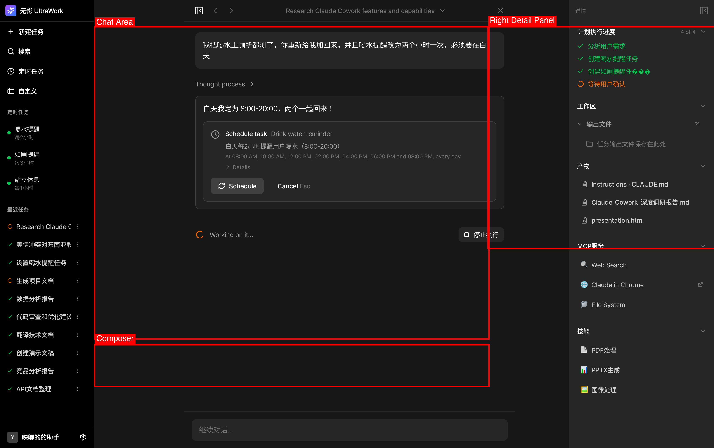

> 红框标注：**Chat Area**（对话消息流：用户消息 + 思考过程 + 定时任务确认卡片 + 执行状态）、**Right Detail Panel**（右侧详情栏：计划执行进度 / 工作区 / 产物 / MCP服务 / 技能）、**Composer**（底部输入框）

### 功能模块详细清单

#### 3.1 Top Bar

| 功能 | 说明 |
|------|------|
| Sidebar 折叠按钮 | 控制左侧栏展开/收起 |
| 前进/后退导航 | 页面级浏览历史 |
| 任务标题 | 居中显示当前任务名称 |
| 关闭按钮 | 关闭 ChatDetail，返回 Home |

#### 3.2 Chat Area（对话区域）

| 功能 | 说明 |
|------|------|
| 用户消息 | 灰色背景气泡展示用户输入 |
| 思考过程 | "Thought process" 可展开/折叠 |
| AI 回复 | 卡片式展示 AI 的回复内容 |
| 定时任务确认卡片 | Schedule task 卡片：任务描述 + cron 规则 + Details 展开 + Schedule/Cancel 按钮 |
| 执行状态 | "Working on it..." 旋转动画 + 停止执行按钮 |
| 执行完成状态 | 绿色勾 + "执行完成" |
| 继续对话 | 底部输入框 "继续对话..." |

#### 3.3 Right Sidebar（右侧详情栏）

| 模块 | 说明 |
|------|------|
| 折叠/展开 | 可折叠为窄条 |
| 计划执行进度 | Plan 步骤列表，绿色勾(已完成) / 橙色旋转(进行中)，显示 "4 of 4" |
| 工作区 | 输出文件目录，可打开工作目录 |
| 产物列表 | Instructions·CLAUDE.md / 调研报告.md / presentation.html 等，点击打开预览 |
| MCP 服务 | 显示当前会话使用的 MCP 服务（Web Search / Claude in Chrome / File System） |
| 技能 | 显示当前会话使用的技能（PDF处理 / PPTX生成 / 图像处理） |

#### 3.4 Artifact Preview（产物预览区域）

| 功能 | 说明 |
|------|------|
| 分屏布局 | 点击产物后，Chat Area 和 Preview 各占 50% |
| 文件名标签 | 顶部显示预览文件名 + 关闭按钮 |
| Markdown 渲染 | .md 文件渲染为格式化文档 |
| HTML 预览 | .html 文件可实时预览 |
| 右侧详情 | 预览模式下详情栏仍然可见 |

### 产物预览截图

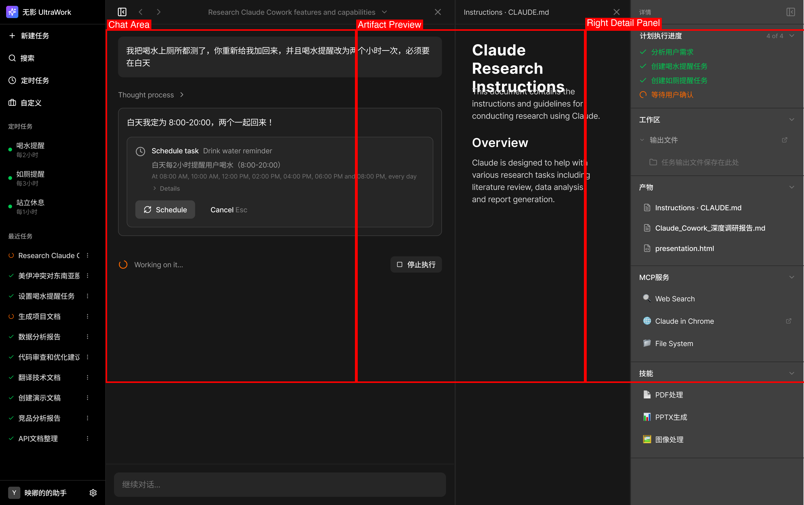

> 红框标注：**Chat Area**（左侧对话流）、**Artifact Preview**（中间产物预览：Instructions · CLAUDE.md 的 Markdown 渲染）、**Right Detail Panel**（右侧详情栏）

---

## 四、Settings Popover（快捷设置菜单）

从左下角头像区域弹出。

### 菜单项

| 菜单项 | 类型 | 说明 |
|--------|------|------|
| 设置 | 全页面 | 打开完整设置页面 |
| 语言切换 | 级联菜单 | 简体中文 / English |
| 工作目录 | 弹窗 | 工作目录配置 |
| 模型（供应商） | 弹窗 | 模型供应商配置 |
| 消息通道 | 弹窗 | 钉钉 / 飞书 / 企业微信 |
| 远程服务连接 | 弹窗 | GitHub / GitLab 等 |
| 帮助文档 | 外部链接 | 打开帮助文档 |
| 关于我们 | 弹窗 | 版本信息 + 相关链接 |

---

## 五、Settings 设置页 (`Settings.tsx`)

### 设置导航

```
设置
├── 通用 (General)
├── 隐私 (Privacy)
└── 能力配置 (Capabilities)
```

### 5.1 通用设置 (`GeneralSettings.tsx`)

#### 个人资料

| 字段 | 说明 |
|------|------|
| 全称 | 用户全名 |
| 昵称 | 显示名称 |
| 工作场景 | 选择工作类型 |
| 回复偏好 | 自由文本描述，例如"在给出详细回答前先提出澄清性问题" |

#### 通知设置

| 设置项 | 类型 | 说明 |
|--------|------|------|
| 开机自启动 | 开关 | 系统启动时自动运行 |
| 后台运行控制 | 开关 | 允许后台运行 |
| 桌面通知 | 开关 | 完成回复时接收通知，对长时间运行的任务尤为有用 |
| 声音通知 | 开关 | 声音提示 |

#### 外观

| 设置项 | 类型 | 说明 |
|--------|------|------|
| 主题风格 | 下拉 | 深色 / 浅色 / 跟随系统 |
| Chat 字体 | 下拉 | 系统默认 / 自定义 |

#### 截图

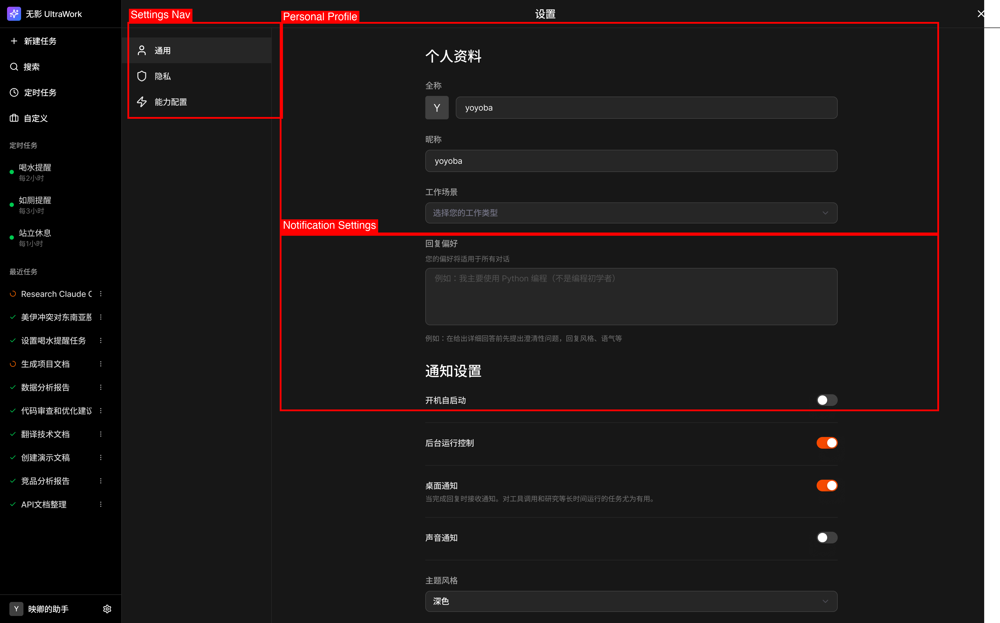

> 红框标注：**Settings Nav**（通用 / 隐私 / 能力配置三个 Tab）、**Personal Profile**（个人资料区域）、**Notification Settings**（通知设置区域）

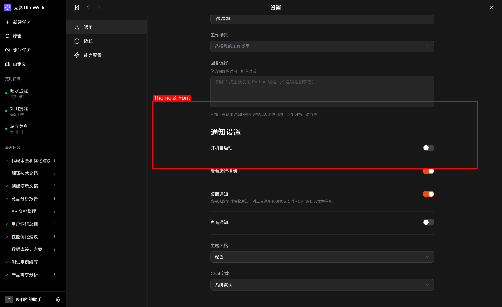

> 红框标注：**Theme & Font**（主题风格下拉选择 + Chat 字体选择）

---

### 5.2 隐私设置 (`PrivacySettings.tsx`)

#### 数据保护

| 功能 | 说明 |
|------|------|
| 隐私声明 | 数据加密存储，仅在用户授权下使用 |
| 使用条款链接 | 外部链接 |
| 隐私政策链接 | 外部链接 |

#### 数据管理

| 功能 | 说明 |
|------|------|
| 数据导入 | 导入工作目录、对话记录和用户设置 |
| 数据导出 | 导出工作目录、对话记录和用户设置 |
| 会话共享 | 开关，允许通过链接分享对话会话 |
| 记忆偏好 | 开关，允许系统记住个性化的偏好 |

#### 数据清除

| 功能 | 说明 |
|------|------|
| 清除所有数据 | 危险操作按钮，清除所有对话记录、设置和用户数据，不可恢复 |

#### 截图

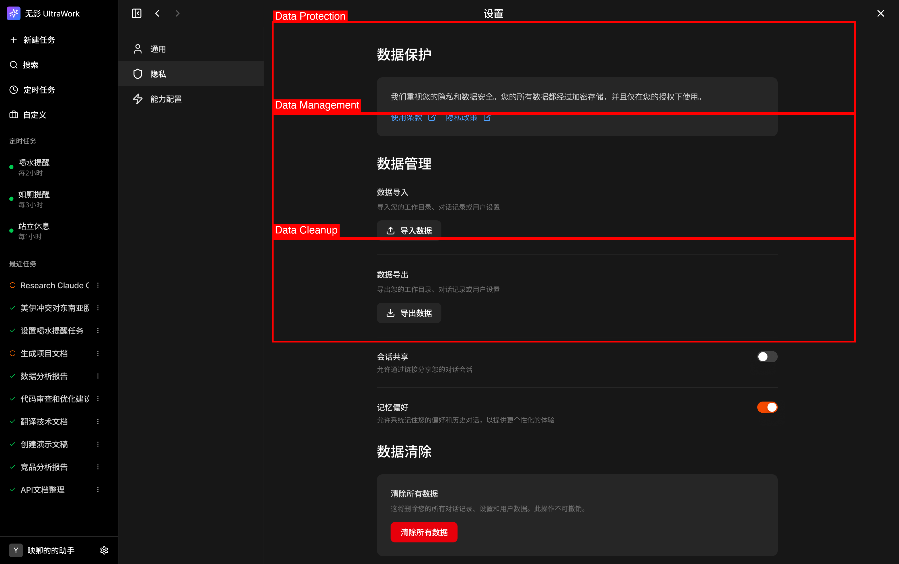

> 红框标注：**Data Protection**（数据保护声明 + 使用条款 / 隐私政策链接）、**Data Management**（数据导入 / 导出 / 会话共享 / 记忆偏好开关）、**Data Cleanup**（清除所有数据按钮）

---

### 5.3 能力配置 (`CapabilitiesSettings.tsx`)

#### 记忆管理

| 功能 | 说明 |
|------|------|
| 从聊天记录生成记忆 | 开关，自动从对话中提取和保存重要信息 |
| 导入记忆 | 从文件导入之前保存的记忆数据 |
| 导出记忆 | 将当前记忆数据导出为文件 |

#### 工具配置

| 功能 | 说明 |
|------|------|
| 工具访问模式 | 三选一：自动（为您自动选择）/ 按需（需要时才加载）/ 始终可用（启动即就绪） |

#### 性能优化

| 功能 | 说明 |
|------|------|
| 清除缓存 | 清除工具和连接器的缓存数据 |

#### 截图

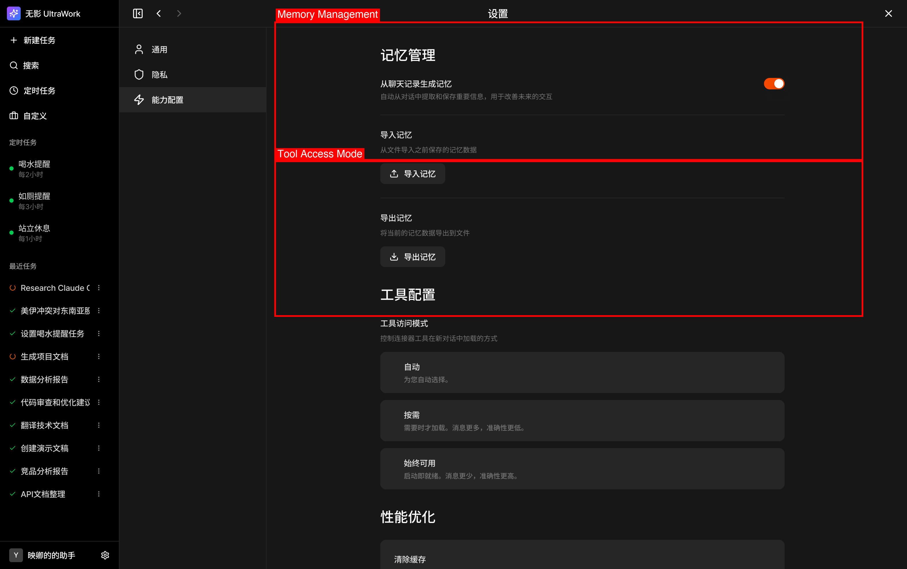

> 红框标注：**Memory Management**（记忆管理：生成记忆开关 + 导入/导出记忆）、**Tool Access Mode**（工具访问模式：自动 / 按需 / 始终可用三选一）

---

## 六、配置弹窗

### 6.1 模型配置 (`ModelDialog.tsx`)

| 功能 | 说明 |
|------|------|
| 搜索 Provider | 模糊搜索模型或供应商 |
| Provider 列表 | Alibaba Cloud / OpenAI / Anthropic 等 |
| 状态标签 | 已启用（绿色）/ 已禁用 |
| 启用/禁用按钮 | 切换 Provider 状态 |
| 配置按钮 | 编辑 Provider 参数（API Key 等） |
| 添加自定义供应商 | 创建兼容 OpenAI API 的自定义 Provider |

#### 截图

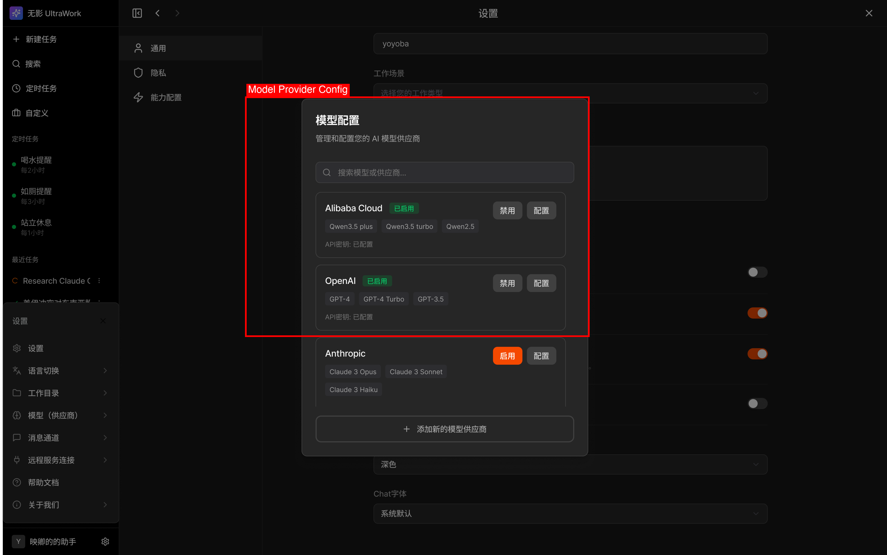

> 红框标注：**Model Provider Config**（供应商列表：Alibaba Cloud + OpenAI + Anthropic，含启用/禁用/配置按钮）

### 6.2 自定义供应商 (`AddProviderDialog.tsx`)

| 字段 | 说明 |
|------|------|
| 显示名称 | 供应商友好名称 |
| Base URL | API 基础 URL |
| 提供商 ID | 小写字母数字和连字符 |
| API Key | 支持环境变量引用 `(env:VAR_NAME)` |
| 模型列表 | 可添加多个模型（模型 ID + 显示名称） |
| 模型参数配置 | JSON 格式（temperature, max_tokens 等） |

#### 截图

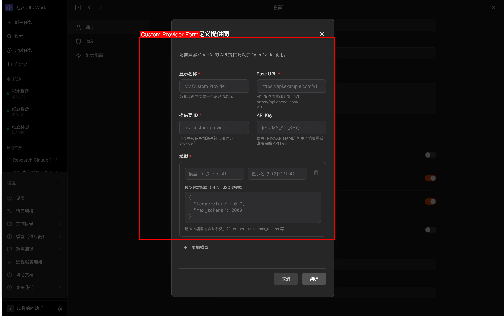

> 红框标注：**Custom Provider Form**（显示名称 / Base URL / 提供商 ID / API Key / 模型列表 / 参数配置）

### 6.3 工作目录配置 (`WorkspaceDialog.tsx`)

#### 目录列表 Tab

| 功能 | 说明 |
|------|------|
| 添加目录 | `+ 添加目录` 按钮 |
| 目录列表 | 名称 + 路径，支持编辑/删除 |
| 启用/禁用开关 | 每个目录独立开关 |

#### 环境配置 Tab

| 功能 | 说明 |
|------|------|
| 沙盒环境 | 安全的隔离环境，推荐使用（默认选中） |
| 本机环境 | 直接访问本地文件系统 |

#### 截图

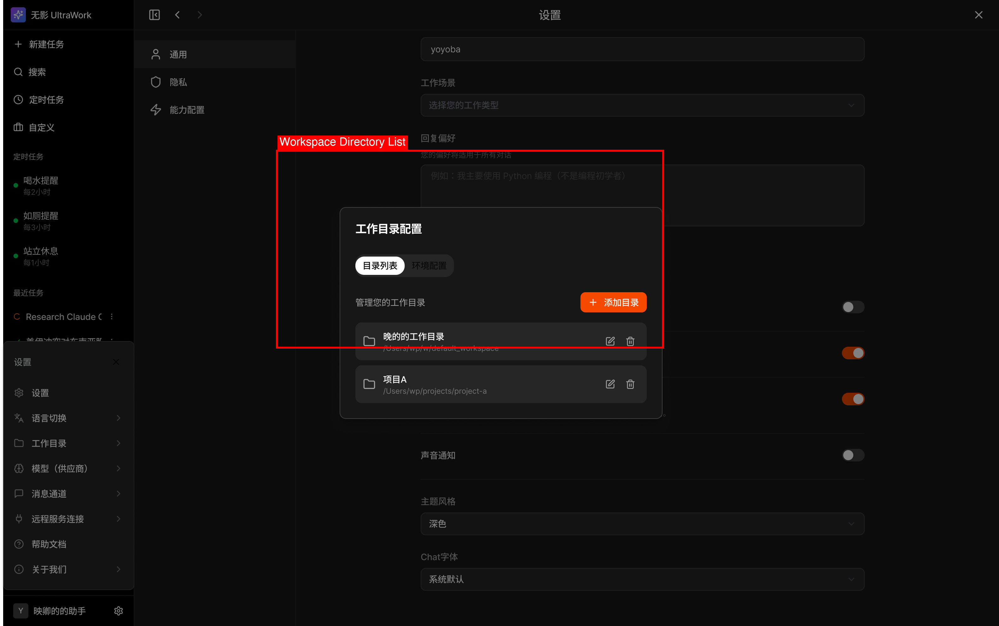

> 红框标注：**Workspace Directory List**（目录列表 Tab：管理工作目录，支持添加/编辑/删除/启用禁用）

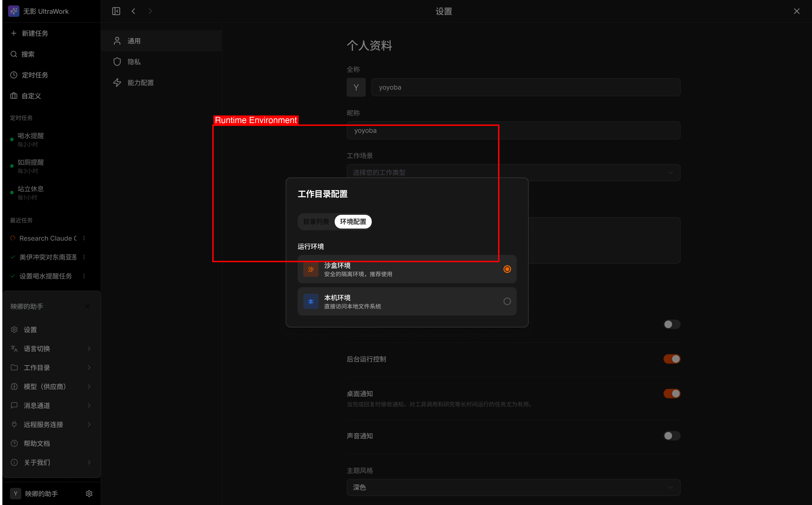

> 红框标注：**Runtime Environment**（环境配置 Tab：沙盒环境 / 本机环境 二选一）

### 6.4 消息通道配置 (`ChannelsDialog.tsx`)

| 通道 | 说明 |
|------|------|
| 钉钉 | 接收钉钉消息通知，配置 Webhook URL |
| 飞书 | 接收飞书消息通知，支持"已配置"状态标识 |
| 企业微信 | 接收企业微信消息通知 |

配置说明：点击配置按钮，按照向导完成 Webhook URL 和访问令牌的设置。

#### 截图

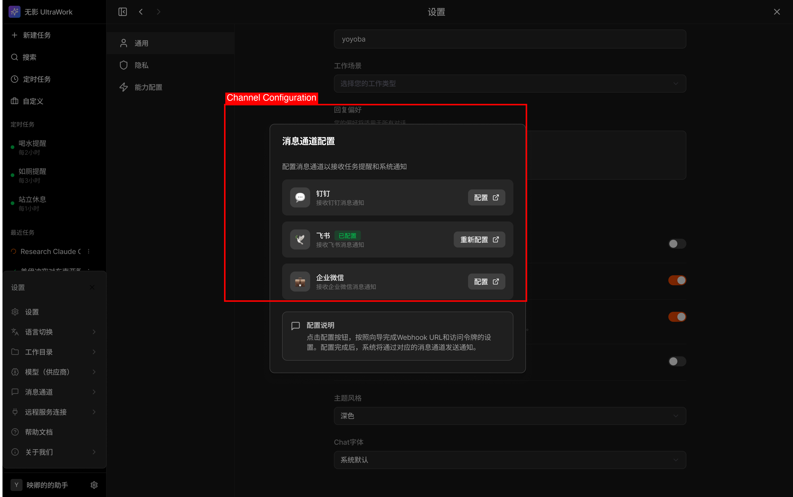

> 红框标注：**Channel Configuration**（钉钉 / 飞书 / 企业微信三个通道，各带配置按钮和启用开关）

### 6.5 远程服务连接 (`RemoteServiceDialog.tsx`)

| 功能 | 说明 |
|------|------|
| 添加服务 | `+ 添加服务` 按钮 |
| GitHub | 显示 URL + 最后刷新时间 + 测试连接 / 断开按钮 |
| GitLab | 显示 URL + 连接按钮 |
| 支持的服务类型 | Git 仓库（GitHub, GitLab, Gitee）/ 项目管理（Jira, Trello）/ 云存储（OSS, S3）/ 数据库服务 |

#### 截图

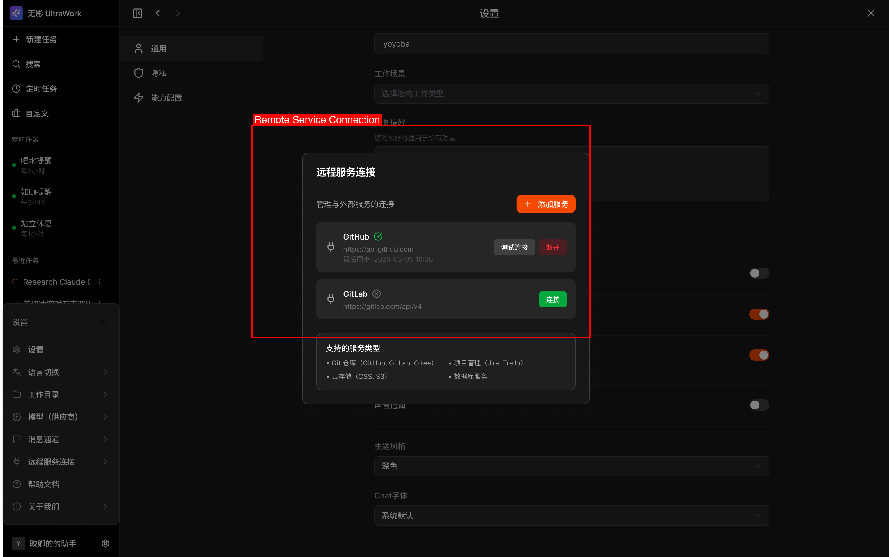

> 红框标注：**Remote Service Connection**（GitHub 已连接 + GitLab 待连接，支持的服务类型列表）

### 6.6 关于我们 (`AboutDialog.tsx`)

| 功能 | 说明 |
|------|------|
| 当前版本 | 如 v1.0.5 |
| 最新版本 | 如 v1.0.6，带"可更新"标签 |
| 更新按钮 | 橙色醒目按钮 "更新到 v1.0.6" |
| 相关链接 | 官方网站 / GitHub 仓库 / 问题反馈 |
| 版权信息 | © 2026 版权所有 |

#### 截图

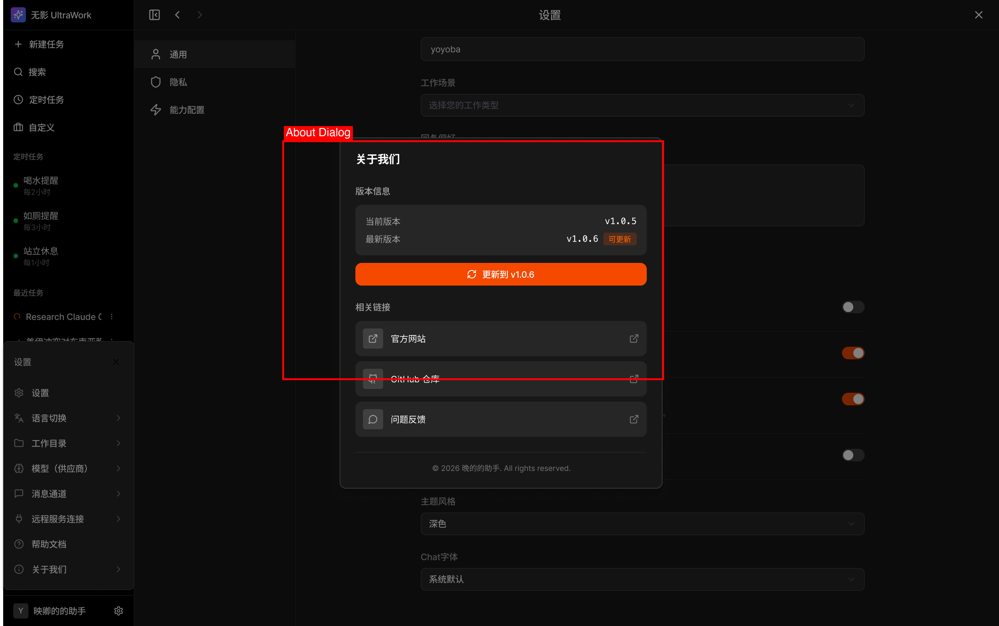

> 红框标注：**About Dialog**（版本信息 + 更新按钮 + 官方网站 / GitHub / 问题反馈链接）

---

## 七、定制化页面（自定义）

全屏独立页面，三栏布局。

### 布局

```
┌────────────┬──────────────┬─────────────────────────────────┐
│  Custom    │  Skill List  │  Skill Detail                    │
│  Nav       │              │                                  │
│            │  算法艺术     │  名称：算法艺术                    │
│  ← 定制    │  ├ 技能.md   │  描述：使用 p5.js 创建...         │
│  技能      │  ├ 模板      │                                  │
│  MCP服务   │  ├ 许可证.txt │  提供者：Anthropic               │
│            │  技能创建器   │                                  │
│  个人资产   │  品牌指南    │  [在聊天中尝试] 按钮              │
│  人力资源   │  画布设计    │                                  │
│  销售      │  ...         │                                  │
└────────────┴──────────────┴─────────────────────────────────┘
```

### 功能清单

| 模块 | 功能 |
|------|------|
| 技能 (Skills) | 列表 + 详情 + 执行 + 开关 + 搜索 + 新建/编辑 |
| MCP 服务 | 列表 + 详情 + 连接开关 + 搜索 |
| 插件 (Plugins) | 列表 + 详情 + 新建 + 搜索 |
| 个人资产 | 分类管理（人力资源 / 销售等） |
| 技能详情 | 名称 + 描述 + 提供者 + 步骤说明 + "在聊天中尝试" |

#### 截图

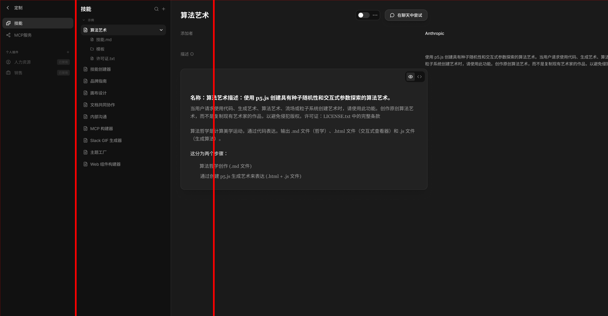

> 红框标注：**Custom Nav**（定制导航：技能 / MCP服务 / 个人资产）、**Skill List**（技能列表 + 文件结构）、**Skill Detail**（技能详情：名称 / 描述 / 提供者 / 步骤说明）

---

## 八、响应式/状态驱动的布局变化

| 条件 | 布局变化 |
|------|----------|
| Sidebar 折叠 | 仅显示图标按钮（~48px），隐藏文字和任务列表 |
| Sidebar 展开 | 显示完整导航 + 任务列表（~210px） |
| Right Sidebar 折叠 | 仅显示折叠按钮（~48px） |
| Right Sidebar 展开 | 显示完整详情面板（~320px） |
| 无选中产物 | Chat Area 全宽 + Right Sidebar |
| 选中产物 | Chat Area 50% + Artifact Preview 50%（Right Sidebar 嵌入预览侧） |
| 任务执行中 | 显示 "Working on it..." 旋转动画 + 停止执行按钮 |
| 任务完成 | 显示绿色勾 + "执行完成" |
| 能力卡片选中 | 展开推荐 Prompt 列表（带渐变遮罩自动滚动） |
| 能力卡片未选 | 仅显示卡片 + 输入框 |
| 深色主题 | 深色背景 + 浅色文字 |
| 浅色主题 | 浅色背景 + 深色文字 |

---

## 九、关键文件索引

| 文件 | 说明 |
|------|------|
| `src/app/App.tsx` | 应用根组件，视图路由 + 状态管理 |
| `src/app/components/Sidebar.tsx` | 左侧栏（任务列表 + 导航 + 用户头像） |
| `src/app/components/MainContent.tsx` | Home 视图（能力卡片 + Composer + 模型选择） |
| `src/app/components/ChatDetail.tsx` | 任务执行详情（对话流 + 右侧栏 + 产物预览） |
| `src/app/components/Settings.tsx` | 设置页面壳（Tab 导航） |
| `src/app/components/SettingsPopover.tsx` | 头像区弹出的快捷设置 |
| `src/app/components/SettingsMenu.tsx` | 快捷设置菜单内容（8 个菜单项 + 级联子菜单） |
| `src/app/components/settings/GeneralSettings.tsx` | 通用设置（个人资料 / 通知 / 主题） |
| `src/app/components/settings/PrivacySettings.tsx` | 隐私设置（数据保护 / 导入导出 / 清除） |
| `src/app/components/settings/CapabilitiesSettings.tsx` | 能力配置（记忆 / 工具访问 / 缓存） |
| `src/app/components/settings/ModelDialog.tsx` | 模型供应商配置弹窗 |
| `src/app/components/settings/AddProviderDialog.tsx` | 自定义供应商表单 |
| `src/app/components/settings/WorkspaceDialog.tsx` | 工作目录配置弹窗 |
| `src/app/components/settings/ChannelsDialog.tsx` | 消息通道配置弹窗 |
| `src/app/components/settings/RemoteServiceDialog.tsx` | 远程服务连接弹窗 |
| `src/app/components/settings/AboutDialog.tsx` | 关于我们弹窗 |
| `src/app/components/settings/LanguageDialog.tsx` | 语言切换 |
| `src/app/contexts/ThemeContext.tsx` | 主题上下文（深色 / 浅色切换） |
| `src/app/utils/theme.ts` | 主题样式工具函数 |
| `src/app/components/figma/ImageWithFallback.tsx` | 图片加载降级组件 |
| `src/app/components/ui/*.tsx` | Radix UI 组件封装（60+ 组件） |

---

## 十、截图索引

| 文件 | 内容 | 标注 |
|------|------|------|
| `ultrademo-img/01-home-full.png` | Home 页（深色主题）全貌 | Left Sidebar, Ability Cards, Composer Input |
| `ultrademo-img/02-home-light.png` | Home 页（浅色主题） | Left Sidebar, Ability Cards, Composer Input |
| `ultrademo-img/03-prompt-recommendations.png` | 推荐 Prompt 展开（浅色） | Ability Cards + Prompts, Recommended Prompts |
| `ultrademo-img/03b-prompt-recommendations-dark.png` | 推荐 Prompt 展开（深色） | Recommended Prompts |
| `ultrademo-img/04-task-detail.png` | 任务执行详情 | Chat Area, Right Detail Panel, Composer |
| `ultrademo-img/05-artifact-preview.png` | 产物预览分屏 | Chat Area, Artifact Preview, Right Detail Panel |
| `ultrademo-img/06-task-operations.png` | 任务右键操作 | Context Menu |
| `ultrademo-img/07-model-selector.png` | 模型选择器 | Model Selector |
| `ultrademo-img/08-add-menu.png` | + 按钮菜单 + MCP 服务 | + Menu, MCP Services Toggle |
| `ultrademo-img/09-settings-general1.png` | 设置 - 通用（资料+通知） | Settings Nav, Personal Profile, Notification Settings |
| `ultrademo-img/10-settings-general2.png` | 设置 - 通用（主题+字体） | Theme & Font |
| `ultrademo-img/11-settings-privacy.png` | 设置 - 隐私 | Data Protection, Data Management, Data Cleanup |
| `ultrademo-img/12-settings-capabilities.png` | 设置 - 能力配置 | Memory Management, Tool Access Mode |
| `ultrademo-img/13-model-config.png` | 模型配置弹窗 | Model Provider Config |
| `ultrademo-img/14-custom-provider.png` | 自定义供应商表单 | Custom Provider Form |
| `ultrademo-img/15-workspace-config.png` | 工作目录 - 目录列表 | Workspace Directory List |
| `ultrademo-img/16-workspace-env.png` | 工作目录 - 环境配置 | Runtime Environment |
| `ultrademo-img/17-channels-config.png` | 消息通道配置 | Channel Configuration |
| `ultrademo-img/18-remote-service.png` | 远程服务连接 | Remote Service Connection |
| `ultrademo-img/19-about.png` | 关于我们 | About Dialog |
| `ultrademo-img/20-customization.png` | 定制化（自定义）页面 | Custom Nav, Skill List, Skill Detail |

> 截图来源：`ultrademopng/` 目录中的 @2x Figma 设计导出图
>
> 标注脚本：`spec/annotate-ultrademo.py`，可随时重新生成
